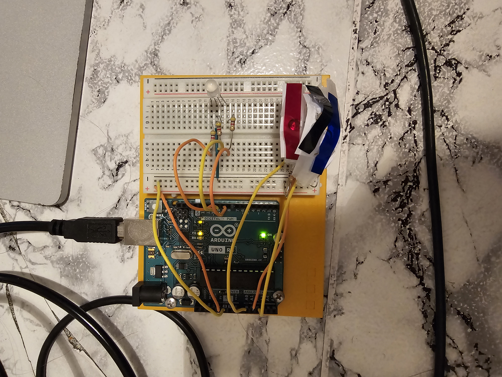
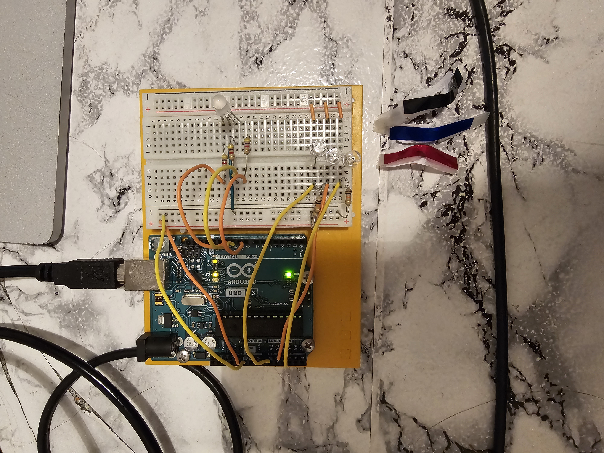

# Arduino-Uno-Project-01-Color-Mixing-Lamp
This project uses an RGB LED and three photoresistors to create a lamp that smoothly changes color based on ambient light. Arduino PWM is used to dim each LED channel, allowing continuous color mixing despite the fixed 5V output.
##  Components

- Arduino Uno  
- Breadboard  
- RGB LED  
- 3 photoresistors (LDR)  
- 3 × 4.7 kΩ resistors (for LDR voltage dividers)  
- 3 × 220–470 Ω resistors (for RGB LED channels)  
- Jumper wires  

---

##  Circuit Description

- **Analog inputs:** `A0–A2` read voltages from three photoresistors (red, green, blue).  
- **Digital PWM outputs:** Pins `9, 10, 11` control RGB LED channels.  
- Each photoresistor controls the corresponding color channel.  
- **PWM** is used to vary LED brightness because the Arduino outputs are fixed at 5V.  
- The lamp color changes smoothly based on ambient light, creating a dynamic color-mixing effect.

---

##  Arduino Code

```cpp
const int greenLEDPin = 9;
const int redLEDPin = 11;
const int blueLEDPin = 10;
const int redSensorPin = A0;
const int greenSensorPin = A1;
const int blueSensorPin = A2;
int redValue = 0;
int greenValue = 0;
int blueValue= 0;
int redSensorValue = 0;
int greenSensorValue = 0;
int blueSensorValue = 0;

void setup() {
  Serial.begin(9600);
  pinMode(greenLEDPin, OUTPUT);
  pinMode(redLEDPin, OUTPUT);
  pinMode(blueLEDPin, OUTPUT);
}

void loop() {
  redSensorValue = analogRead(redSensorPin);
  delay(5);
  greenSensorValue = analogRead(greenSensorPin);
  delay(5);
  blueSensorValue = analogRead(blueSensorPin);

  Serial.print("Raw Sensor Values \t Red: ");
  Serial.print(redSensorValue);
  Serial.print("\t Green: ");
  Serial.print(greenSensorValue);
  Serial.print("\t Blue: ");
  Serial.println(blueSensorValue);

  redValue = redSensorValue / 4;
  greenValue = greenSensorValue / 4;
  blueValue = blueSensorValue / 4;

  Serial.print("Mapped Sensor Values \t Red: ");
  Serial.print(redValue);
  Serial.print("\t Green: ");
  Serial.print(greenValue);
  Serial.print("\t Blue: ");
  Serial.println(blueValue);

  analogWrite(redLEDPin, redValue);
}




  analogWrite(greenLEDPin, greenValue);
  analogWrite(blueLEDPin, blueValue);
}
